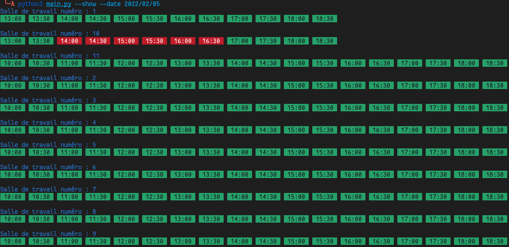

# reserve_BU

Réservons des places à la BU depuis le terminal !! (Attention à l'emplacement du geckodriver)

## État actuel
Arrive à voir les disponibilités, mais la réservation n'est pas encore implementée

## Bibliothèques utilisées
Les bibliothèques nécessaires à l'exécution sont :
* **`Calendar`**
* **`BeautifulSoup`**
* **`Selenium`**

